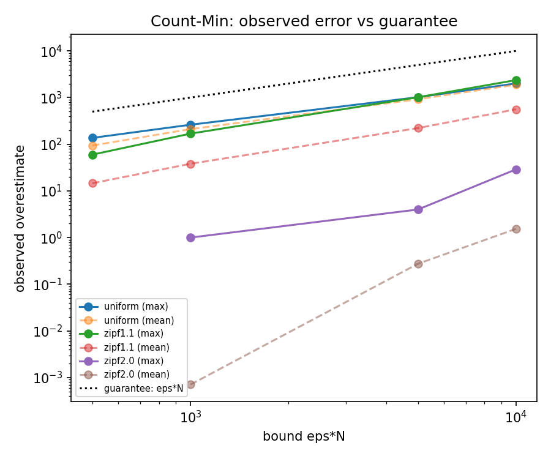
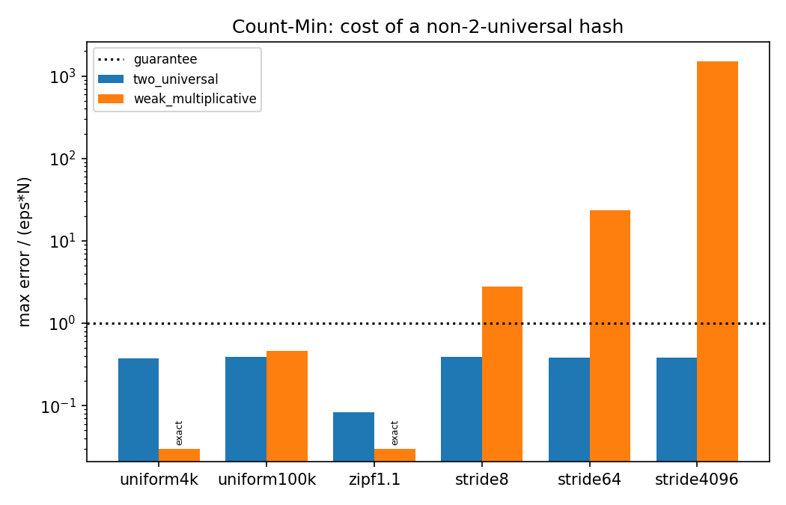
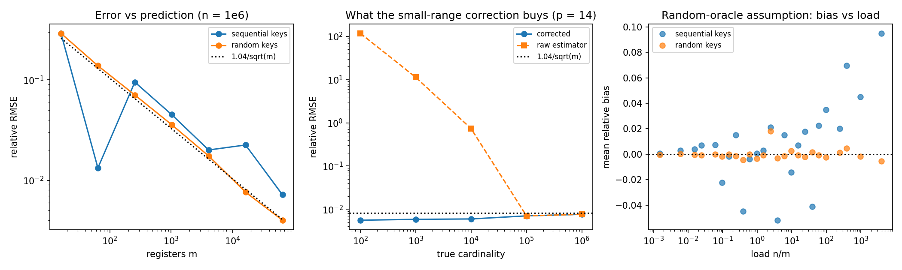
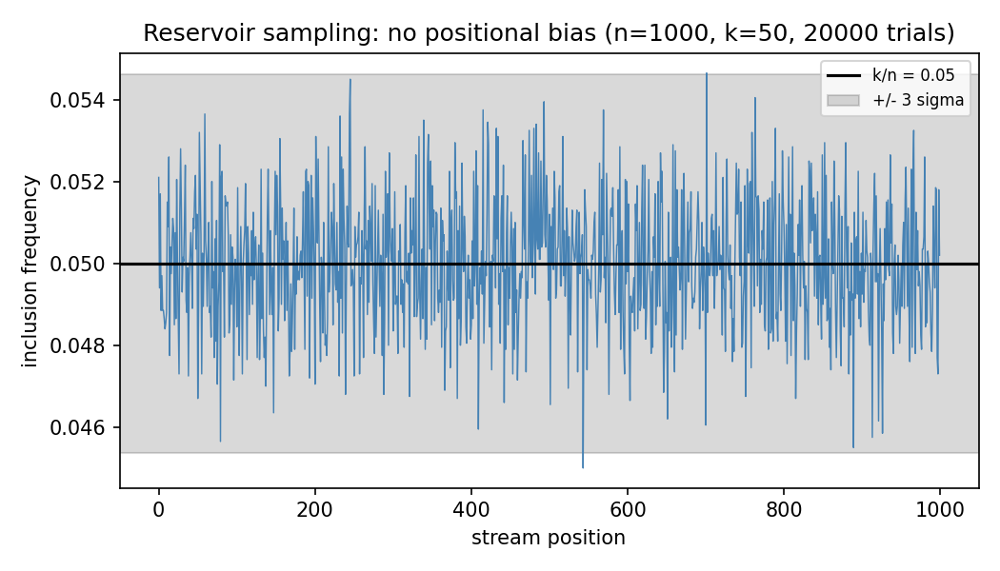
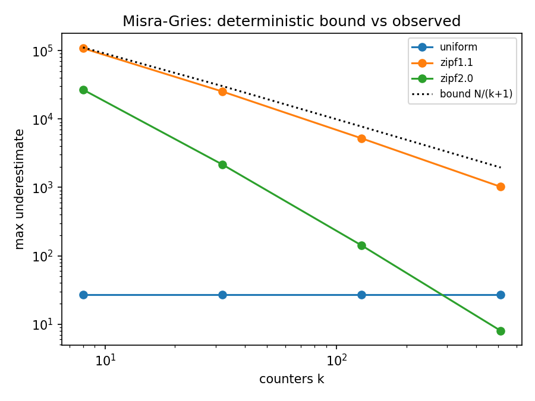

# Do streaming sketches meet their error bounds?

Every structure in this library ships with a proved error guarantee. This report
checks each one against measurement, and asks two questions the pseudocode never
answers: **how much slack is in the bound**, and **what happens when the
assumption the proof rests on is quietly violated**.

Setup: g++ 15.2 (MinGW-w64) at `-O2`, Windows 11. Streams of N = 10^6 items over
a universe of 10^5 keys unless stated; uniform, Zipf(1.1), Zipf(2.0), and
stride-aligned key sets. HyperLogLog figures average 100 independent trials,
reservoir figures 20,000. All seeds are fixed, so `./build.sh` reproduces every
number below. Raw output is in `results/`, figures in `figures/`.

---

## 1. Count-Min: the bound holds, and it is loose by a factor that depends on the stream

Guarantee: with width w >= e/eps and depth d >= ln(1/delta),
f(x) <= f_hat(x) <= f(x) + eps*N with probability at least 1 - delta.

Across 12 configurations (three streams x four values of eps, delta = 0.01) there
were **zero violations out of 2.0 million key estimates**. The interesting part
is the margin:

| stream | eps | width | mean error | max error | bound eps*N | max / bound |
|---|---|---|---|---|---|---|
| uniform | 0.01 | 512 | 1888 | 2011 | 10,000 | 0.20 |
| uniform | 0.001 | 4096 | 211 | 262 | 1000 | 0.26 |
| zipf1.1 | 0.01 | 512 | 562 | 2375 | 10,000 | 0.24 |
| zipf1.1 | 0.001 | 4096 | 38.2 | 169 | 1000 | 0.17 |
| zipf2.0 | 0.01 | 512 | 1.54 | 29 | 10,000 | 0.0029 |
| zipf2.0 | 0.0005 | 8192 | 0 | 0 | 500 | 0.0000 |

Two things fall out.

**The mean error matches the per-row theory, and the minimum over rows does the
rest.** For the uniform stream at w = 512 the expected collision mass in a single
row is N/w = 1953; the measured mean over five rows is 1888. The bound of eps*N =
10,000 is stated for the *maximum* over keys at confidence 1 - delta, so a factor
of ~5 of headroom at the mean is exactly what the analysis predicts, not slop.

**Skew makes the bound loose, but not for the obvious reason.** At w = 512 the
Zipf(1.1) mean error is 562 against 1888 for uniform, even though both streams
carry the same total mass N. The bound uses N because it must hold for the worst
key; in a skewed stream a light key only suffers if it collides with a heavy one,
and the minimum over d = 5 rows lets it escape that in most rows. Skew does not
reduce the collision mass, it makes the mass concentrated enough that the
`min` can dodge it. At Zipf(2.0) the sketch is *exact* once w = 8192, because
only 1416 distinct keys exist and the table has room for all of them.

The practical reading: eps*N is a worst-case number that a real workload rarely
approaches, and sizing a sketch from it buys 4x to 1000x more accuracy than
requested, depending entirely on the distribution.

---

## 2. The hash family is not a detail, and a random test will not catch it

This is the experiment worth reading. Count-Min's proof needs one property:
a 2-universal family, so Pr[h(x) = h(y)] <= 1/w for x != y, with each row drawn
independently. `WeakHash` in `include/sketches/hash.hpp` is Knuth multiplicative
hashing with a per-row additive seed — a hash that looks entirely respectable and
is genuinely fast. It is not 2-universal. With a power-of-two table the multiplier
C is odd and therefore invertible mod w, so

> h_i(x) = h_i(y)  <=>  C*x + s_i = C*y + s_i (mod w)  <=>  x = y (mod w)

for **every** row i. The seed cancels. Two keys that collide in one row collide in
all of them, so taking a minimum over d rows buys nothing at all.

Fixed w = 4096, d = 5, N = 10^6, so eps = e/w and the bound is 664.

| stream | hash | cells used (row 0) | max error | max / bound | keys over bound |
|---|---|---|---|---|---|
| uniform, 10^5 keys | 2-universal | 4096 | 262 | 0.39 | 0 |
| uniform, 10^5 keys | weak | 4096 | 308 | 0.46 | 0 |
| Zipf(1.1) | 2-universal | 1158 | 55 | 0.08 | 0 |
| Zipf(1.1) | weak | 4096 | **0** | 0.00 | 0 |
| stride 8 | 2-universal | 3554 | 262 | 0.39 | 0 |
| stride 8 | weak | 512 | 1849 | **2.8** | 100% |
| stride 64 | 2-universal | 3145 | 255 | 0.38 | 0 |
| stride 64 | weak | 64 | 15,671 | **23.6** | 100% |
| stride 4096 | 2-universal | 1394 | 252 | 0.38 | 0 |
| stride 4096 | weak | **1** | 999,812 | **1506** | 100% |

Read the top of the table first. On random keys the weak hash is not merely
acceptable, it is *better* than the sound one — and on the 4096-key streams it is
perfectly exact, because x -> C*x mod 4096 is a bijection there. **No amount of
testing on random or Zipfian data reveals the defect.** It is invisible until the
key set has structure.

Then read the bottom. Aligned keys are not exotic: pointers are 8- or 16-byte
aligned, IPv4 addresses inside a routed prefix share low bits, timestamps land on
a fixed tick. Feed the sketch keys that are multiples of 4096 and every one of
them lands in a single cell per row; the estimate for every key becomes N, the
error is 1506x the guarantee, and **100% of keys violate a bound that was
supposed to fail for at most 1%**. The `cells used` column is the mechanism made
visible: 4096 cells, then 512, then 64, then 1.

The 2-universal family never exceeds 0.39 of its bound on any of the six streams.

One honest caveat visible in the same table: 2-universality bounds *pairwise*
collisions, it does not promise uniform occupancy. On the 4096-key streams the
Carter-Wegman rows use only 1158 of 4096 cells, because h(x) = (a*x + b mod p)
restricted to a short contiguous range is close to an arithmetic progression. The
bound still holds, comfortably, because pairwise collision probability is the only
thing the proof consumes. That gap between "satisfies the hypothesis" and "looks
random" is the whole point.

---

## 3. HyperLogLog: the correction is doing almost all of the work, and the hash matters here too

Predicted standard error is 1.04/sqrt(m) for m = 2^p registers.

**With random keys the prediction is essentially exact.** At p = 16, measured
relative RMSE is 0.00400 against a predicted 0.00406; at p = 14, 0.00762 against
0.00813. Mean relative bias stays inside +/- 0.14% at every precision.

**The small-range correction is not a refinement, it is the difference between
working and not working.** At p = 14 (16 KB of registers), estimating a
cardinality of 100:

| true n | raw estimator RMSE | with linear counting | 1.04/sqrt(m) |
|---|---|---|---|
| 100 | 117.65 (11,765%) | 0.0056 | 0.0081 |
| 1000 | 11.30 | 0.0058 | 0.0081 |
| 10,000 | 0.733 | 0.0060 | 0.0081 |
| 100,000 | 0.0070 | 0.0070 | 0.0081 |

Below the 2.5m threshold the raw harmonic-mean estimator is off by four orders of
magnitude, because almost every register is still zero and the estimator has no
signal to work with. The two curves meet exactly where the correction switches
off, at n = 10^5 > 2.5m = 40,960.

**The random-oracle assumption is stronger than Count-Min's, and it does break.**
HyperLogLog's analysis assumes the hash behaves like a random function — strictly
more than the 2-universality Count-Min needs. Running the identical sketch over
sequential keys 0, 1, 2, ... instead of random 64-bit keys, hashed through one
round of the splitmix64 finalizer:

| p | m | keys | relative RMSE | mean bias | predicted |
|---|---|---|---|---|---|
| 14 | 16,384 | random | 0.00762 | -0.0007 | 0.00813 |
| 14 | 16,384 | sequential | 0.0225 | **+0.0225** | 0.00813 |
| 16 | 65,536 | random | 0.00400 | -0.0009 | 0.00406 |
| 16 | 65,536 | sequential | 0.00717 | **+0.0072** | 0.00406 |

At p = 14 the error is 2.8x the predicted standard error, and the RMSE equals the
bias — this is a systematic overestimate, not noise, so averaging more trials will
never remove it. The bias grows with load n/m (right panel of the figure) and
reaches +9.5% at p = 8. A single-round finalizer is a bijection, which guarantees
distinct hashes, but distinctness is not the property HyperLogLog needs: it needs
the leading-zero counts to be geometrically distributed, and consecutive inputs
leave enough residual structure in the top bits that they are not.

This is the same lesson as experiment 2 arriving through a different door. Both
sketches are correct; both are being fed a hash that fails the hypothesis of the
theorem, and in both cases the failure is invisible on random input.

---

## 4. Reservoir sampling: uniform, including where people expect it not to be

Algorithm R guarantees every item seen is in the sample with probability exactly
k/n. The intuition people distrust is positional: surely early items get evicted?
Measured inclusion frequency per stream position over 20,000 independent runs:

| n | k | k/n | min observed | max observed | max abs z |
|---|---|---|---|---|---|
| 1000 | 50 | 0.05 | 0.0450 | 0.0547 | 3.24 |
| 1000 | 200 | 0.20 | 0.1913 | 0.2086 | 3.09 |
| 10,000 | 100 | 0.01 | 0.0075 | 0.0128 | 3.98 |

The z-scores are the right size rather than merely small: the maximum of 10^4
standard normals is expected to land near 3.9, and 3.98 was observed. There is no
drift with position — the trace is flat across the whole stream — and no
configuration shows an outlier beyond what independent binomial sampling predicts.

---

## 5. Misra-Gries: a deterministic bound, and where it is actually tight

Guarantee, with k counters: f(x) - N/(k+1) <= f_hat(x) <= f(x), with no
probability attached. Every item with f(x) > N/(k+1) must survive.

Zero violations in 12 configurations, and **perfect heavy-hitter recall
everywhere** (46 of 46 at k = 512 on Zipf(1.1)). Unlike the probabilistic bounds
above, this one is nearly saturated on the right input:

| stream | k | max underestimate | bound N/(k+1) | fraction of bound used |
|---|---|---|---|---|
| uniform | 8 | 27 | 111,111 | 0.02% |
| uniform | 512 | 27 | 1949 | 1.4% |
| zipf1.1 | 8 | 108,113 | 111,111 | **97.3%** |
| zipf1.1 | 32 | 25,238 | 30,303 | 83.3% |
| zipf2.0 | 8 | 26,858 | 111,111 | 24.2% |
| zipf2.0 | 512 | 8 | 1949 | 0.4% |

This is the mirror image of experiment 1. Count-Min's probabilistic bound was
never approached; Misra-Gries' deterministic bound comes within 3% of saturation
on Zipf(1.1) with 8 counters, because moderate skew is precisely the case where
many mid-frequency items keep decrementing each other. Uniform traffic barely
touches it (27 out of 111,111). A deterministic bound is worth more than a
probabilistic one of the same size — but it is also the one you should expect to
actually pay.

---

## What this adds up to

1. All four bounds hold, over roughly 2 million estimates. That is the baseline,
   and it is the least interesting finding.
2. The probabilistic bounds are loose by 4x to 1000x on realistic streams; the
   deterministic one is tight to 3%. Sizing from the worst case wastes memory in
   the first three cases and is honest in the fourth.
3. Both failures found in this project came from the hash, not the algorithm, and
   neither was visible on random input. A sketch is only as good as the hypothesis
   its proof assumes, and that hypothesis is the part implementations skip.

## Limitations and what would come next

- Single-threaded, single machine, one compiler; no attempt at throughput
  benchmarking, which would need attention to cache behaviour that this code does
  not pay.
- Zipf streams are generated i.i.d. from a fixed distribution; real telemetry has
  temporal locality that would change the Count-Min minimum's behaviour.
- The HyperLogLog bias result identifies the mixer as the cause but does not
  characterise it. Testing murmur3/xxh3 finalizers against the same sequential key
  set, and measuring the leading-zero distribution directly, is the obvious next
  step.
- Registers are one byte each rather than the packed 6 bits of a production
  implementation, so `bytes()` overstates real HyperLogLog memory by 25%.

## References

- G. Cormode, S. Muthukrishnan. *An improved data stream summary: the count-min sketch and its applications.* Journal of Algorithms 55(1):58-75, 2005.
- J. L. Carter, M. N. Wegman. *Universal classes of hash functions.* JCSS 18(2):143-154, 1979.
- P. Flajolet, E. Fusy, O. Gandouet, F. Meunier. *HyperLogLog: the analysis of a near-optimal cardinality estimation algorithm.* AofA 2007, 137-156.
- S. Heule, M. Nunkesser, A. Hall. *HyperLogLog in practice.* EDBT 2013, 683-692.
- J. S. Vitter. *Random sampling with a reservoir.* ACM TOMS 11(1):37-57, 1985.
- J. Misra, D. Gries. *Finding repeated elements.* Science of Computer Programming 2(2):143-152, 1982.
